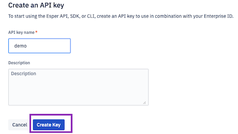

## How to Generate an API KEY From the Console?

  

The first step in interacting with our API is to generate an API key you can tie to it. Do this by clicking **Create Key**.

You can also copy the Enterprise ID, necessary for API calls, by clicking on the copy icon next to Enterprise ID on the top right of this section.

  
  

Enter a unique API name and description (optional) and click **Create Key**.

  
  

  

Click **Generate Token**. This will generate a unique OAuth-based API key.

  

  

You can then copy (or renew if needed) your API key. API keys need to be renewed every 3 months.

  

  
  

You will need your API key and Enterprise ID to access our  [CLI platform](https://github.com/esper-io/esper-cli) as well as to use the SDK/API in your development and management systems. You can find additional information about this process by clicking on  [Developer Hub](https://docs.esper.io/) and [API Documentation](https://api.esper.io/).

**Note**: An API key is tied to the user account used to create the key. If you delete a user via User management, then any API keys associated with that user will also be deleted and will be immediately invalidated for API, SDK, and CLI use. To avoid the situation where API keys are unintendedly deleted when a user account is deleted, a best practice is to create a specific user account just for API key management. The Enterprise ID is specific to your endpoint and does not change.