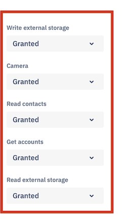
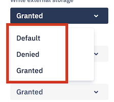
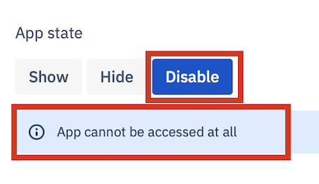
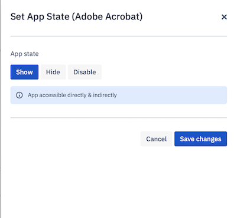

## How to Manage Applications on a Single Device?

Clicking the name of the device, on the ‘Device & Group’ screen, you will be able to access the "Apps" tab. This section lists the Applications that are installed on the device. For each Application, the information about the Application Name, the Application Type, the Version Code, the Package Name, the Application State, and the Actions are displayed.

  


  

You can search for a particular application by entering part or entire application name.

  


  

The applications that are already installed on the device are specified in this list with the following filters:

-   All Apps- All applications installed on the device.
-   Enterprise Applications- Private applications that are installed using the [Esper Cloud](../apps/upload-apps.md).
-   Google Apps- Google applications installed using your managed Google Play account.
-   Preloaded Applications- Applictaions that were pre-installed by the device maker in ROM.
    


  
### Set Application Permissions on Device From the Console

  

Application  permissions allow users to configure multiple permissions state on a device like camera access to an application, read and write to external storage permissions, contacts access ad accounts permissions.

Step 1: To access application permissions of any application, click the ellipsis and select ‘Set App Permissions’ from the options.

  
  


  

You can change the following permissions:

-   Read Contacts
-   Get Accounts
-   Read external storage
-   Write external storage
    

  



  

You have three options for each attribute to choose from for app permissions viz Default, Denied, and Granted.

  



  

### Set an Application State on the Device from the Console

  

An Application can have 3 states: Show, Hide, and Disable.

*Show state*: Show state keeps the application accessible directly and indirectly on your device, which means the user can access the application directly on your device or via some other application.

  


  

:::tip
The ‘Show’ state will be auto-selected.
:::

  

*Hide state*: If an application is set to 'Hide', it can still run in the background.

  


  

*Disable state*: If you want to prevent an application from running, use ‘Disable’.

  

Disable state is helpful for in-ROM applications that you cannot uninstall.  This state prevents the running of such applications and avoids impacting the user experience. It ensures no needless data consumption.



:::tip
In-ROM (preloaded) applications cannot be uninstalled. They can be hidden.
:::

Following are the steps to access the application state:

Step 1: Click on the ellipsis and choose the ‘Set App State’ option.


  
  

Step 2: Choose one of the three available states and click the button **Save Changes.**


  

### Clear the Application Data on the Device from the Console

  

Esper provides users a way to clear application data from the Console on their device.

  

To access the “Clear data”, click the ellipsis and select the “Clear Data” option.

  


  
  
  

Slide-out from the right will allow you to clear data. Click the “ **Clear**” button.

  
  


  

This will send a request to the device to clear application data. Upon success, you will get a successful response message.

  


### Manage Configurations for Existing Applications on a Device from the Console

  

Manage configuration gives the admins the flexibility to manage work applications from the Console. From the ‘Device & Group’ screen, click the name of the device for which you want to manage applications. Navigate to the ‘Apps’ tab.

  

Step 1: For the selected application, click the ellipsis for more actions.

  


  

Step 2: Choose ‘Manage Configurations’ from the drop-down. On the pop-up, type the JSON code for the key-value pair.


Following is a sample code for Chrome (version 86 and above) Manage Configuration:
```
{"URLBlocklist":[
  "example.com",
  "https://ssl.server.com",
  "hosting.com/bad_path",
  "https://server:8080/path",
  ".exact.hostname.com",
  "file://*",
  "custom_scheme:*",
  "*"],
  "SafeBrowsingProtectionLevel":1,
 "HomepageLocation":"https://www.chromium.org", "CookiesBlockedForUrls":[
  "https://www.example.com",
  "[*.]example.edu"
 ],
 "DefaultGeolocationSetting":3     
 }
```
Following is a sample code for Chrome (Version below 86) Manage Configuration:

```
    {"URLBlacklist":[
    "example.com",
    "https://ssl.server.com",
    "hosting.com/bad_path",
    "https://server:8080/path",
    ".exact.hostname.com",
    "file://*",
    "custom_scheme:*",
    "*"],
    "SafeBrowsingProtectionLevel":1,

    "HomepageLocation":"https://www.chromium.org", "CookiesBlockedForUrls":[
    "https://www.example.com",
    "[*.]example.edu"
    ],
      "DefaultGeolocationSetting":3     
    }
```

Step 3: Click **Apply** to save the changes. Clicking **Cancel** will take you back to the 'app setting' screen.

:::tip
If you have managed configurations applied for an application, you will be able to edit the configurations. Only valid key-value pairs will be applied to the application and shown in the box below. 
:::

 


A toast message will indicate success or failure for the action.


