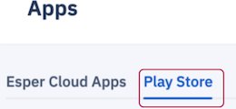
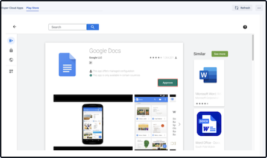
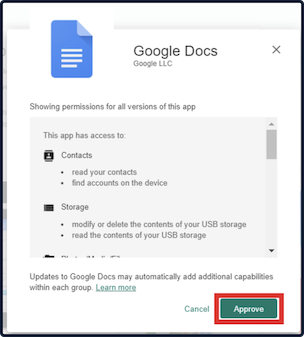

## How to Approve Google Play Apps?

  

The Esper Console gives you access to Play for Work, the enterprise version of Google Play. Within Play for Work, you can approve apps, which can then be downloaded onto your devices. You can also unapproved apps, which will then cease to be visible or available in the Google Play store on your devices.

  

Step 1: To approve a Google Play app, click on Play Store.

  
  

Step 2: Enter the name of the App into the Google Play search box and click on the magnifying glass.

  

Step 3: Click on the tile for the app.

  

Step 4: Click on **Approve**.

  
  
  

Step 5: In the popup box that appears, click on **Approve**.

  
  
  

Step 6: Select the radio button next to the way you would like to handle new app permission requests. Selecting Keep approved results in the best user experience as the user will not have to grant any new permissions on the device, however, you need to be sure you trust the app provider if you choose this option. If you’d like to receive an email notification whenever an app requests new permissions, click on the Notifications tab and add your email address in the space provided. Then click **Done**.

  

  
  
  
**Note**: Be sure the app supports the appropriate minimum API level for the GMS devices you wish to deploy the app to, and that you are in a supported country for the app. If either of these is mismatched, Google Play will prevent the installation of the app onto non-conforming devices either during provisioning or while installing from Esper.