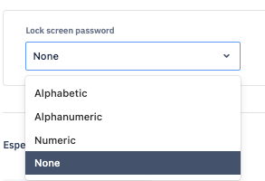
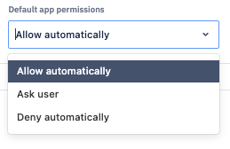
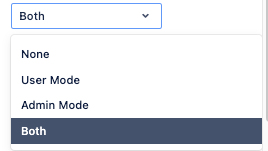
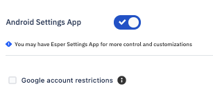
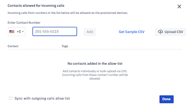
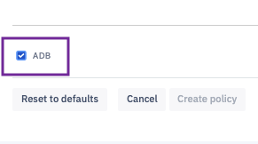

## How to Create a New Policy?

  

To create a new compliance policy, click **New Policy**. Here you can create a new policy. The layout is the same as when you [define a Compliance Policy in a Provisioning Template](../provisioning-template/createtemplate.md),  but uniquely includes the name and description.

  


  

### Enter a Policy Name and Description

Enter a unique name for the new compliance policy in the Policy Name field; enter an optional description in the Description field.


  

### Set Lock Screen Password via Policy

  

The Lock Screen Password specifies the conditions for the device unlock password; the default is None.



If you choose alphabetic or alphanumeric, you must set a password length of at least 4 characters and up to 25. Use the up/down arrows to set the required password length.


-   Alphabetic: Restricts acceptable password to only upper and lowercase alphabetic characters (A to Z, and a to z).
-   Alphanumeric: Expands acceptable passwords to include numbers, and special characters in addition to alphabetic characters.
    

:::tip
There is no password required to unlock the device.
:::

The user will set up the password for a device during the initial setup.

The lock screen must be On in order to set Lock Screen Password rules. If you select either Alphabetic or Alphanumeric password rules, then the lock screen will be set to On by Esper if it is currently Off.

  

### Set Default App Permission Rules via Policy

  

Default application permissions determine enforcement of the runtime-rules across all the apps on a device including Enterprise applications installed by Esper, in-ROM applications that are enabled, as well as applications installed via Managed Google Play. This ensures you can control the user experience on the device regarding how run-time permissions are granted.



There are three possible settings:

-   Allow Automatically: This rule will grant all the permissions for any application requests without showing a prompt to the user. Allow automatically is the typical setting used for single-purpose solutions using a fully trusted, customer-supplied application.
-   Ask User: This keeps the default behavior intact with regards to permission management. All applications on the device will show a prompt to the user to request permission. For example, each time before accessing a device module, all applications will prompt the user with a message such as “Allow application X to access Gallery? Allow/Deny. Ask user option might not be ideal in some solutions, especially Kiosk-based applications. It can help certain unusual situations dealing with App permissions— contact us directly to find out more.
-   Deny Automatically: This rule will deny any permission request from any application on the device. The Console will not notify the user. You can [grant permissions to applications individually](../apps/control.md) from the Esper Console.
    

### Set System Update Rules via Policy

  

The System updates option allows you to enforce a system update policy on the device when a system update is available via the device’s over-the-air (OTA) update service.


There are four possible settings:

-   Update Automatically: This option will install any over-the-air (OTA) updates automatically as soon as they become available without user interaction, and reboots the devices when necessary.
-   Postpone Installation: This option postpones installation of an OTA update for 30 days. After 30 days, the system will prompt the device user to install the update. Subsequent updates will also follow the same 30-day postponement. This is ideal when you need time to validate your solution against new system updates before they are installed.
-   Windowed Installation: This option allows you to define a window of time during which the OTA update will be installed without user interaction. This option is ideal for devices with a known down period. A drop-down will appear to enable you to set the start and end times for the maintenance window.    
-   Disable Update: This option allows you to disable updates on the device. It is available for a limited set of OTA services that support this feature. If the device does not support disabling updates, it will default to Postpone Installation. Before setting this option please contact Esper to make sure the devices you plan to provision support this configuration.
    

### Configure Esper Settings Application via Policy

Esper offers a custom settings application that gives device users access to a subset of the available Android settings. The Esper settings application is intended for use by technicians servicing a device locally.


Esper setting application has two modes:

1.  User Mode
    
2.  Admin Mode
    


This application offers the following settings:

-   Wi-Fi: Change the Wi-Fi access point used by the device. In Android 10 devices and above, it is recommended to enable GPS to view the network information on the device’s Wi-Fi screen. In the devices below Android 10, enabled GPS is needed to display scanned network information.
-   Flashlight: Turn On the Torch (AKA “flashlight”) if the device has a camera flash LED.
-   Auto-Rotation: Turn auto-rotation On or Off.
-   Factory Reset: Perform a factory reset of the device, regardless of the compliance policy applied.
-   Kiosk App Selection: Change the app that runs in kiosk mode. The device user can choose any installed app on the device to act as the kiosk app, with the Esper Console kept in sync on the configuration stats.
-   Esper Branding: Turn Off the Esper logo on the 'Home' screen.
-   About: Supplies information regarding the endpoint name the device is enrolled in, in case the customer has access to multiple Esper endpoints.
-   Mobile Data: Access mobile data on the device.
-   Clear App Data: Clears the data and cache for a particular application.
-   Display: Manage screen rotation, screen brightness and screen timeout.
-   Sound: Manage ringtone, alarm, device volume and the notification volume.
-   Reboot: Ability to reboot the device.
-   Keyboard: Navigate to Android settings on the Android 8.1 and lower devices to change the keyboard settings.
-   Accessibility: Navigate to Android settings on the Android 8.1 and lower devices to change the accessibility settings.
-   Input Selection: Navigate to Android settings on the Android 8.1 and lower devices to change the input selection for the device.
-   Bluetooth: Navigate to Android settings on the Android 8.1 and lower devices to change the bluetooth setting.
-   Language: Navigate to Android settings on the Android 8.1 and lower devices to change the language setting.
-   Date and Time: Navigate to Android settings on the Android 8.1 and lower devices to change the date and time for the device.

Users have the ability to add or remove settings in both modes.



Admin Mode is password protected to prevent unauthorized access. This password controls access to the hidden dock available in kiosk mode, the Esper Settings app, and serves as the PIN used for IMEI-based provisioning via AfW. The password is alphanumeric and can have 1 to 10 characters.

The default password is 1234. It is possible to set up a template without a password for these features, or just leave the default password; Esper strongly recommends setting up a more complex password for stronger security. The same password will be set for all devices provisioned using the template

:::tip
A hidden doc is available in both the kiosk mode and the multi-app mode. You can access it with 3-taps on the right corner in kiosk mode or 3-clicks on the power button in multi-app mode. 
:::

You can now launch the Esper Setting or Wi-Fi settings directly from the third-party application. If the 3-tap or power button is not available, you can send intent to open the Esper settings or wifi menu now from your application. 

```java
fun launchEsperSettings() {
        val intent = Intent()
        intent.component = ComponentName("io.shoonya.shoonyadpc", "com.shoonyaos.shoonyasettings.activities.MainActivity")
        intent.flags = Intent.FLAG_ACTIVITY_NEW_TASK
        startActivity(intent)
}
```

### Manage Android Settings Application via Policy

  

This setting will display the icon for the default Android settings application on the Home screen of the device. Clicking this icon will take the user to the default Android settings. Depending on the other configurations set by the Compliance Policy, some options may be disabled to the user. Just by switching On/Off via console users can control it on the device.



  

### Google Account Restriction via Policy

  

This setting enables you to restrict the number of Google accounts that can be added on the device and used with Google apps like Gmail, Google Play Store, and YouTube. By default, any number of accounts can be added to a specific device; this setting restricts this number. For example, if you set this setting to two, only two accounts will be permitted on the device, further addition (or deletion) of accounts will not be possible unless a different compliance policy is reapplied.


:::tip
If you don’t check the Google account restrictions box and plan to provision your device in Multi-application mode, we recommend disabling Google Play Store to prevent the installation of unapproved applications.
:::

:::tip
The Google Account Restriction feature is applicable only to Google Mobile Services (GMS) Android devices. If you include the Android Settings App and wish to prevent any Google accounts from being added, set the Number of accounts to 0.
:::

### Protect Device from Hard/Soft Factory Reset via Policy

Factory Reset Protection (FRP) places an auto-lock on a GMS-certified device if a user factory resets it with soft or hard keys. FRP will auto-lock the device and keep it locked until a pre-authorized Google account ID is entered. Additional information about getting your Google Account ID can be found in the [here](../apps/googleplaysignup.md).

When you turn On the FRP button in the provisioning template, you’ll need to pick a Google account to authorize future device unlocks. Your chosen Google account ID will reverse any future auto-lock events triggered by user factory resets for all devices provisioned with this template.


:::tip
Factory reset protection is only available on GMS devices running Android 5.1 and above.
:::

### Lock Screen Configuration via Policy

The lock screen template setting enables the default lock screen to be displayed whenever a device screen times out, according to the default timeout specified in the Settings section. If this is On, the device user will have the option to set the password. The users must enter a password that conforms with the rules.


### Safe Mode Login Configuration via Policy

When Safe-Mode login is On, users will be able to boot to Safe Mode on the device; when Safe-Mode login is Off, users will be unable to boot to Safe Mode.


### Factory Reset Configuration Control for Android Settings via Policy

Factory Reset controls if users can perform a factory reset using the Android Settings App. When Factory Reset is off, the user will not be able to perform a factory reset on the device. This does not prevent a hard-key factory reset, see [Factory Reset Protection](../provisioning-methods/factory-reset.md) to prevent hard-key factory reset.


### Notification Bar Configuration via Policy

If you want device users to be able to swipe down to see the notification bar, set Notification Bar to on. If you don’t, set it off. You will typically want the notification bar turned off for Android kiosk mode. But, you may choose to leave this setting On if you will request bug report submissions from device users. User bug report requests from Esper generally must be sent via the notification bar.

### Screenshot Configuration via Policy

If you want device users to be able to take screenshots, set Screenshot to On. If you don’t, set it Off. Turning this setting off blocks users from taking a screenshot using a hard key sequence or available softkeys.

### Block External Hardware via USB Connectivity Configuration via Policy

USB connectivity allows users to connect USB devices, such as flash drive, digital camera, mouse, or keyboard to the device. If you want device users to be able to connect other hardware to the device, set USB Connectivity to On. If you don’t, set it Off.

  

### SMS Configuration via Policy

SMS controls sending and receiving of SMS, or text messages. If SMS is turned off, the device will not send or receive text messages from any SMS application. Set SMS to On if you wish to enable sending and receiving of text messages.

### Outgoing Calls Configuration via Policy

If you want device users to be able to make outgoing calls, set Outgoing Calls to On. If you don’t, set it Off.

### Camera Access Configuration via Policy

If you want device users to be able to use the camera, set Camera Access to On. If you don’t, set it Off.

:::tip
Your application can still access the camera if this setting is off.
:::

### NFC Configuration in Policy

If you want device users to use near-field communication (NFC) On their devices when supported, set NFC to On; if you don’t, set it to Off. If any of your applications require NFC, make sure this setting is On.

### Google Play Store Configuration via Policy

If you want device users to have access to your Managed Google Play Store, set the Google Play Store setting to On; if you don’t, set it to Off.

You’ll still be able to install any approved Google Play Store applications from Esper On if Play Store is turned Off. This only applies to GMS devices, as AOSP devices do not include Google Play Store support.

### USB Tethering Configuration via Policy

USB tethering specifies if the user can share a mobile connection to another device such as a laptop. If you’d like device users to share a mobile connection with other devices, set the USB tethering to On; if you don’t, set it to Off.

### Date and Time Configuration via Policy

Edit Date and Time If you’d like device users to be able to set device date and time, set the Edit Date and Time setting to On; if you don’t set it to Off.

### Block Application Uninstall Locally on the Device via Policy

Setting Application Uninstall to On will block application uninstalls locally on the device and via Esper's cloud Console. Set it to off if you need to uninstall applications remotely.

:::tip
You can update your application installed on the device using Esper if Application Uninstall is set to On.
:::

### USB File Transfer Configuration via Policy

If you’d like device users to be able to transfer files from the device using a USB cable or flash drive, set USB file transfer to On; if you don’t, set it to Off.

### Google Assistant Configuration via Policy

If you’d like device users to be able to use voice command via Google Assistant on supported devices, set Google Assistant to On; if you don’t, set it to Off.

:::tip
On some devices, this setting may need to be on if you wish to have Google Play Store show up on the device.
:::

### Local Application Install Configuration via Policy

This feature allows the installation of applications from unknown sources on the device. To enable this on the device, the user needs to follow these instructions. **Settings** >**Apps** and **Notifications** > **Special App Permissions**> Install Unknown Applications and choose the route they wish to install the applications from.

For example, if the device user chooses Chrome, they will be able to download and install applications from the Chrome browser on the device. If turned Off, the device user will not be allowed to install applications from any unknown sources.


### Allow List Configuration for Incoming and Outgoing Calls via Policy

Selecting allow all incoming and outgoing calls button will not block any caller. 


Selecting the checkbox next to Restrict outgoing/incoming calls using a customized dialer opens up two checkboxes:

-   Restrict incoming calls to uploaded contacts only
-   Restrict outgoing calls to uploaded contacts only
    


You can add phone numbers or upload a CSV file of contacts to add to the allowed list only.



  
  

:::tip
All numbers must be preceded by +country code (for example, +1 for the US). All numbers must be separated by a comma.
:::

### ADB Configuration in the Policy

Android Debug Bridge (ADB) is a command-line tool that provides a Unix shell to communicate with an Android device. If the ADB option is checked in the device’s Compliance Policy, you may turn On ADB via Devices Device > Settings for a configurable time period. If the ADB option is unchecked in the Compliance Policy, ADB cannot be turned On from Settings.



Opening the device ADB port is required on most stock Android devices before the Esper agent can securely connect to the Esper Cloud for ADB debugging. Learn more about using ADB with Esper [here](../devices-groups/device-settings.md).

:::tip
Turning On ADB from the device is never allowed on any Esper-provisioned device.
:::

### Resetting to Default Settings

You may reset these values to default at any time by clicking the Reset to Default button at the bottom of this panel. 

