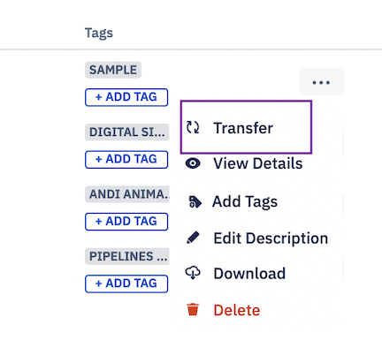

## How to Transfer a File to Any Device or Group of Devices?

Step 1: Click on the ellipsis for more actions on a file. Choose the ‘Transfer’ option.

  

Step 2: To select the groups and/or devices you wish to transfer this file to, choose the appropriate "Groups" or "Devices" tab and click **Link** against the specific device or group. The selected list of devices and/or groups will be displayed on the right pane. You may use the search option to find a particular device or group easily. 

  

  

Step 3:  Provide the destination file path on the devices. One example of an internal storage path would be /storage/emulated/0/download/.

Once complete, click **Transfer**. 

You can transfer files to internal storage or removable storage device like SD cards. All the removable storage devices will have a unique eight-character ID. You just need to add a prefix "ESPER_EXTERNAL" if the ID is not known.

You can append the path with the "forced/" keyword (example:"forced/storage/emulated/0/Esper/NewFolder/"), which will ask users permission for that directory (if the directory exists). On granting access, the files will be saved anywhere in internal storage, public directories, and removable storage. 

:::tip
The ability to store files anywhere is available in Esper Agent version v7.4.9751 and above. Please reach out to ([Esper support](mailto:support@esper.io)) for this version.
:::
 

Success or fail toast message will appear on the bottom left of your Console screen once the file transfer has been successfully completed. 