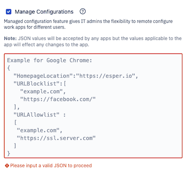
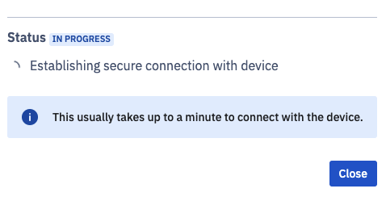
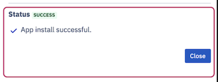
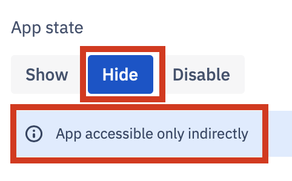
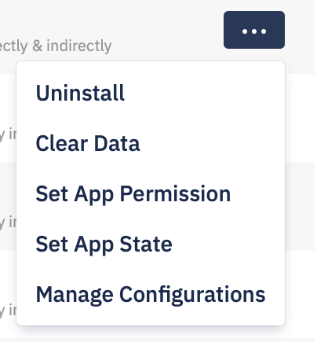
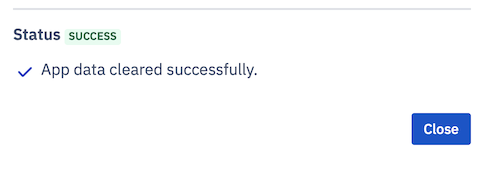
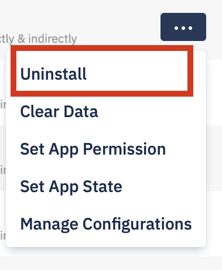
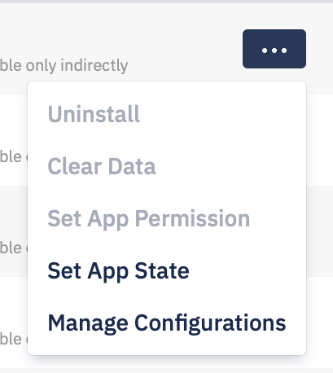
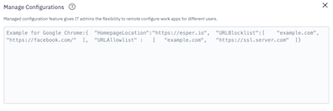

## How to Manage Apps on a Single Device?

Clicking on the name of the device, on the ‘Device and Group’ screen, you will be able to access the Apps. This section lists the Apps that are installed on the device. For each App, the information about the App Name, the App Type, the Version Code, the Package Name, the App State, and the Actions are displayed.

  

  

You can search for a particular application by entering part or all of the application name.

  

  

The applications that are already installed on the device are specified in this list with the following filters:

-   All Apps installed on the device
    
-   Enterprise Apps are private apps that have installed using the [Esper Cloud](../provisioning-template/README.md).
    
-   Google Apps installed using your managed Google Play account.
    
-   Preloaded Apps that were pre-installed by the device maker in ROM.
    

  

### Install a New App on Device From Console

  

Esper allows users to install both private and google apps via a unified experience.

  

Step 1: The **New App** Install button lets you install new apps on the device.

  

  

Step 2: You will see a slide out from the right when you click on the **New App Install** button. Here, you will be able to select the app from the list of all approved Google apps and all uploaded Enterprise apps.

  

  

Step 3: If you have multiple app versions or builds you can select which version you wish to install from the list.

  

If you choose the manage config check box, you will be prompted to enter a valid JSON code. This feature gives administrators flexibility to remotely configure work apps. 

**Notes**:

  

1.  Manage configurations can be applied to android devices 5.0 or above.
    
2.  All the apps will accept these JSON values. You will be able to see the changes only on the apps where the JSON values are applicable.

  

Step 4: On selection of version, the system will show you app preview, check if all the details are correct, and then click on Install.

  

  

Step 5: App installation will start and you can see the status “ In progress” in the status section.

  

 The app installation screen also includes an estimated total time required for the installation. If an error occurs, the console will display an error message. 

Step 6: Upon successful installation, you will see the app installation success message in the status section.

  

  

Once you close the slideout, you can see the app you installed in your app list.

  

### Set App Permissions on Device From the Console

  

App  permissions allow users to configure multiple permissions state on a device like Camera access to an app, read and write to external storage permissions, contacts access ad accounts Permissions.

Step 1: To access app permissions of any app, click on the ellipsis and select ‘Set App Permissions’ from the options.

  
  

  

You can change the following permissions:

  

-   Read Contacts
    
-   Get Accounts
    
-   Read external storage
    
-   Write external storage
    

  

  

You are provided with three options for each attribute to choose from for app permissions viz Default, Denied, and Granted.

  

  

### Set an App State on the Device from the Console

  

An App can have 3 states: Show, Hide, and Disable.

*Show state*: Show state keeps the app accessible directly and indirectly on your device which means the user can access the app directly on your device or via some other app.

  

  

**Note**: By default, the ‘Show’ state will be auto-selected.

  

*Hide state*: If an app is set to 'Hide', it can still run in the background.

  

  

*Disable state*: If you want to prevent an app from running, use ‘Disable’.

  

This is useful for apps such as in-ROM apps that cannot be uninstalled but need to be prevented from running to avoid impacting your user experience or to ensure they do not needlessly consume data.

**Note**: In-ROM (preloaded) apps cannot be uninstalled. They can be hidden but can not be uninstalled

Following are the steps to access the app state:

Step 1: Click on the ellipsis and choose the ‘Set App State’ option.

  
  

Step 2: Choose one of the three available states and click the button **Save** changes.

  
  

Once you set the state click on save changes and your changes will be applied to the app on your device.

### How to Clear the App Data on the Device from the Console

  

Esper provides users a way to clear app data from the console on their device.

  

To access the “Clear data” of any app, click on the ellipsis and select the “clear data” option.

  

  
  
  

Slide-out from the right will have the option to clear data. Click on the “ **Clear**” button.

  
  

  

This will send a request to the device to clear app data. Upon success, you will get a successful response message.

  

  

### Uninstall an App on the Device from the Console?

  

You can uninstall the app on your device from the app section. Following are the steps to uninstall an app:

  

Step 1: In the apps section, click on the ellipsis and choose the ‘Uninstall’ option.

  

  

Step 2: On the slide-out from the right side console, click the button **Uninstall**.

  

Step 3: A command will be sent to the device to uninstall the app and you will get a success message on completion.

  
  

**Note**: You cannot uninstall an app if a device is offline.

  

### Manage Configurations for Existing Apps on a Device from the Console

  

Manage configuration gives the admins the flexibility to manage work apps from the console. From the ‘Device and Group’ screen, click on the name of the device for which you want to manage apps. Navigate to the ‘Apps’ tab.

  

Step 1: For the selected app, click on the ellipsis for more actions.

  

  

Step 2: Choose ‘Manage Configurations’ from the drop-down. On the pop-up, type the JSON code for the key-value pair.

Step 3: Click **Apply** to save the changes. Clicking **Cancel** will take you back to the app setting screen.

 **Note:** If you have managed configurations applied for an app, you will be able to edit the configurations. 
 

A toast message will indicate success or failure for the action.

### Activity feed

Click on the info icon to the far right of the screen to view the history of app installation and uninstall events performed on the device.

This Activity field includes information about Timestamp, Application name, Application version, Package name, Application type, and status of the event (Success, In Progress, Failure, or Cancelled).

