##  How to Manage Apps for a Group?

  

The Apps tab lets you manage the apps on all the devices in the group. This includes installing new apps, uninstalling apps, scheduling an app installation, and approving apps for the group.

  

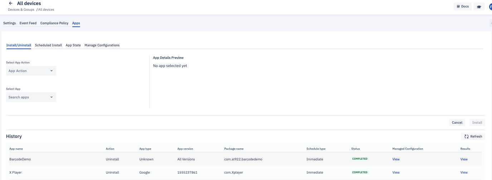

**Note**: If you wish to update a currently installed app to a new version, you install that new version using any of the available means. You cannot uninstall in-ROM apps (called Preloaded apps). Instead, you can Disable these apps using Approvals.

###  Install/Uninstall a New App on Device Group From the Console

  

The Apps section lets you install or uninstall both privately uploaded apps—also known as Enterprise Apps—and Google Play apps to the groups immediately. The action will only be performed on online devices.

  

Group Uninstall works much the same. Simply select Uninstall rather than Install from the Select App Action dropdown.

  

Step 1: To install an app on all the devices in the group first select Install/Uninstall, then select Install from the Select App Action dropdown.

  
  

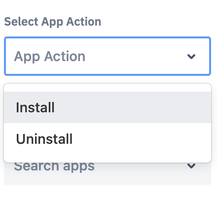

  

Step 2: Device info preview shows how many devices are offline or online.

  

  

Step 3: Then select the app you’d like to install from the Select App dropdown. You can also type the first few letters of the app’s name into the search box to quickly find the app.

  

Step 4: Select app version.If you select the check box for manage configurations, you will be prompted to enter JSON code. Managed configurations will allow the administrator to configure work apps remotely.

  

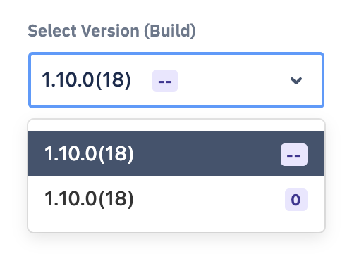

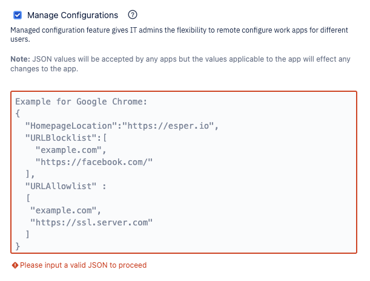

  

Step 5: Once you’ve selected an app, its details will appear in the App Details Preview section, including the app’s version, package name, and app type—that is, whether it’s an enterprise app or a Google app.

  

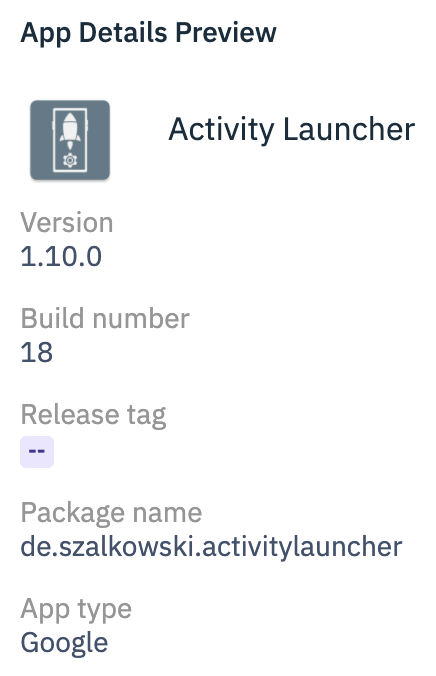

  

Step 6: Queue requests to offline devices if required and click Install.

  

  

Step 7: After clicking on install, the right sidebar will slide and you can check the status of the installation.

  

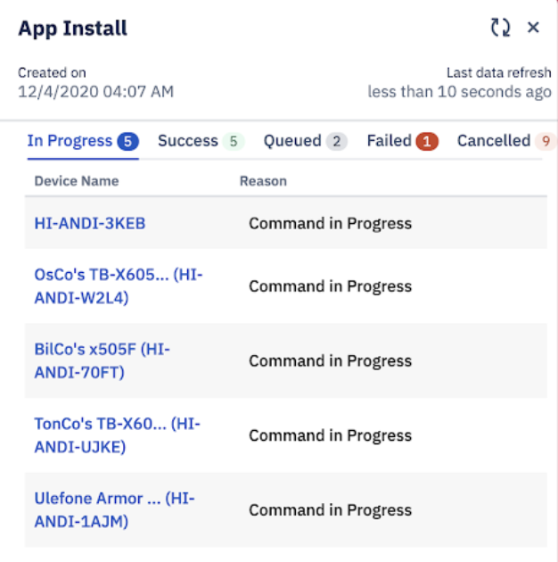

  

You can anytime check the history of app installation/schedules etc.

###  How to Schedule App Install/Uninstall on device group from the Console?

This section lets you schedule an app installation or uninstallation for a specific point in the future. To schedule an install, select Schedule Install. Schedule Group Uninstall works much the same. Simply select Uninstall rather than Install from the Select App Action dropdown.

  
  

Step 1: To schedule an app installation or uninstallation, click on the Create scheduled install button.

  

Step 2: You will be taken to a new screen where you enter the schedule details. Enter a unique name for the scheduled installation or uninstallation in the Name field.

**Note**: Names cannot be reused.

  

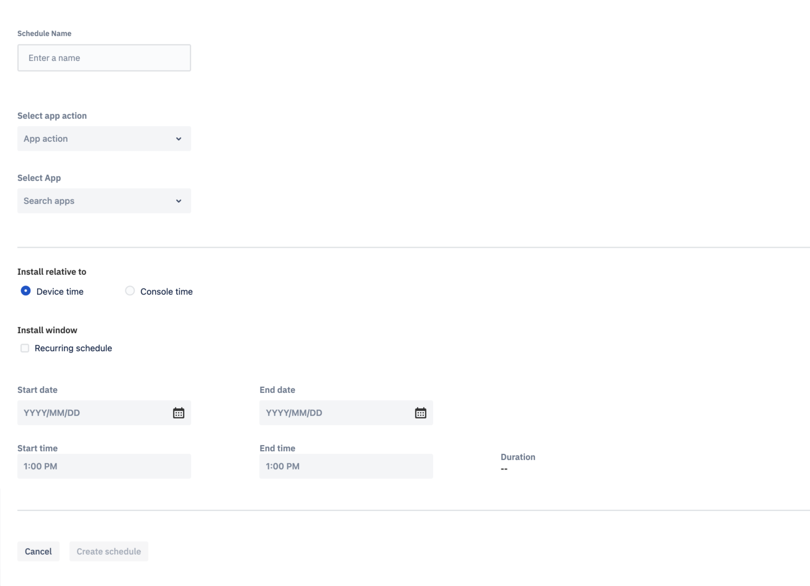

  

Step 3: Select Install or Uninstall from the Select App Action dropdown.

  

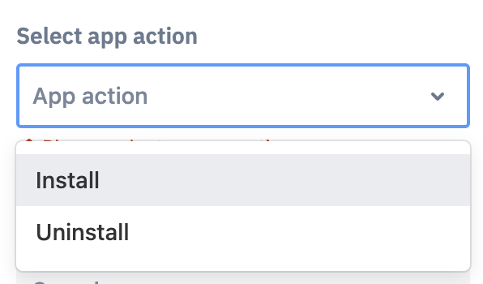

  

Step 4: Select the app you want to install or uninstall from the Select App dropdown.

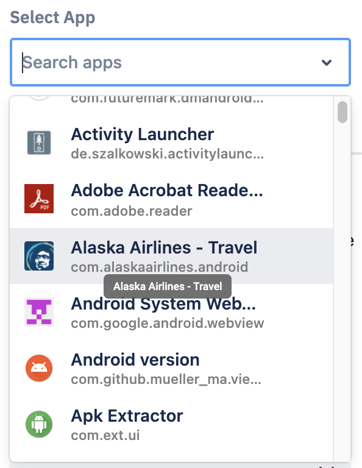

  

Step 5: Use the radio buttons to choose between using the device’s time or your console’s time when scheduling an application installation or uninstallation for a group. If you select Device time when you schedule an app installation, the installation (or uninstallation) will be performed on the devices in that group whenever it’s the specified time on each device.

  

  

Step 6: You also have the option to define a recurring schedule by selecting Recurring schedule — for instance, to schedule an application installation every Monday between 2:00 AM and 5:00 AM from May 1st to May 10th.

  

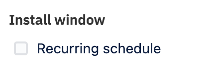

  

Step 7: Select start and end dates from the Start Date and End Date dropdowns and start and stop times from the Start Time and End Time dropdowns. Then click Create Schedule.

  
  

Step 8: After the scheduled installation has been completed, you can see the status of the action by clicking View Results next to the entry for the installation.

  

  
  
  

###  Set App State on the Device Group From the Console

  

The App State section enables you to show, hide or disable in-ROM apps (also referred to as Preloaded apps) on all the devices in the group.

  

  

To change the app state status of an app, enter its package name in the box and click Show, Hide, or Disable.

  

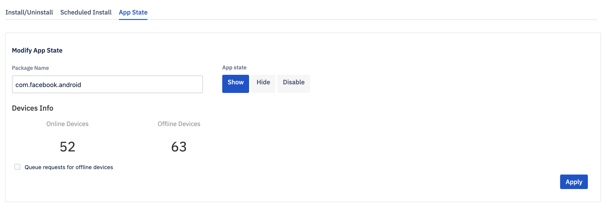

  

Click Apply. The console will display the group command status.

  

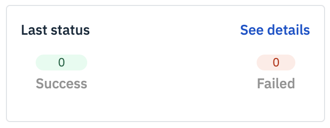

  

Clicking See Details will cause a sidebar to slide in from the right showing the status of the installation.

Note: You will need to enter the exact package name of any in-ROM apps you wish to show, hide, or delete. For example, Chrome’s package name is “com.android.chrome;” just entering “Chrome” or “Google Chrome” will not work.

  

###  Finding Package Names

The best way to get the exact package name of an in-ROM app is to use an Android Debug Bridge (ADB) command to retrieve the names of all the packages.

Physically connect to the device using a USB cable and authorize ADB usage on the device by going to Device > Settings. Once ADB usage is authorized, the following command will retrieve the names of all the package names:

adb shell pm list packages

ADB will return a list of all the apps running on the device:

You can also view the package names for any apps installed on a device by viewing the device’s details and selecting Apps. The package name for each app is displayed in the resulting list view.

### Manage Configurations

This section enables you to view the configurations applied to the group. When you enter a valid package name, you will be able to see the JSON code. All the apps will accept these JSON values. You will be able to see the changes only on the apps where the JSON values are applicable.

  
**Note**: Manage configurations are supported only on android devices 5.0 or above.