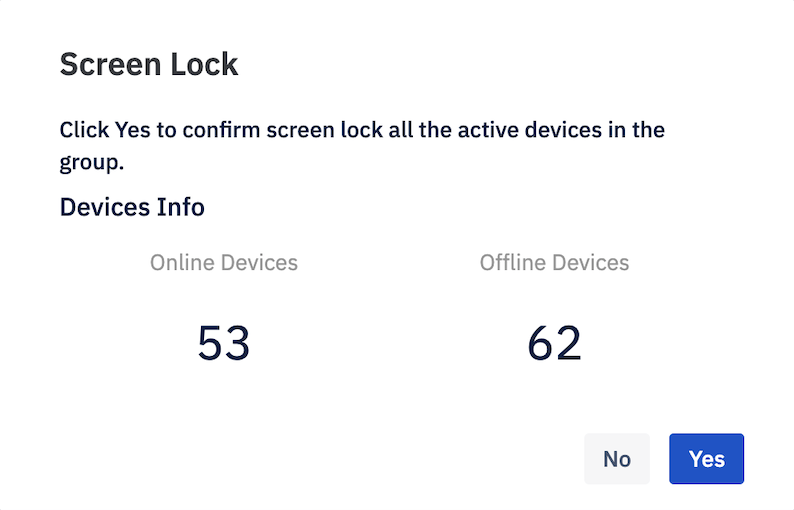
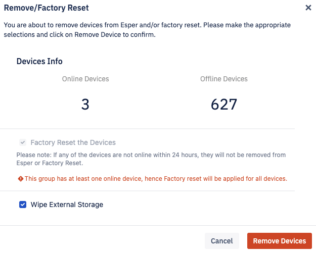
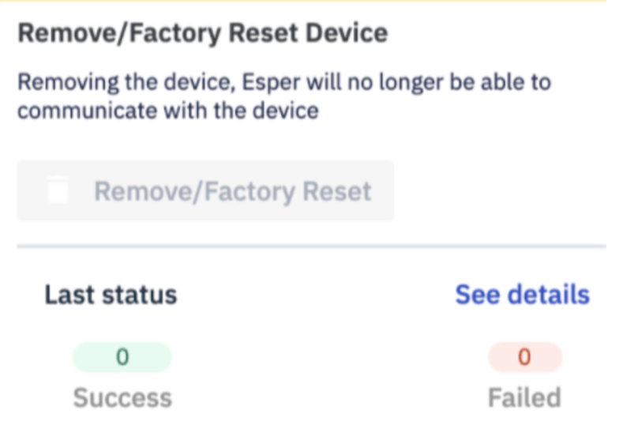
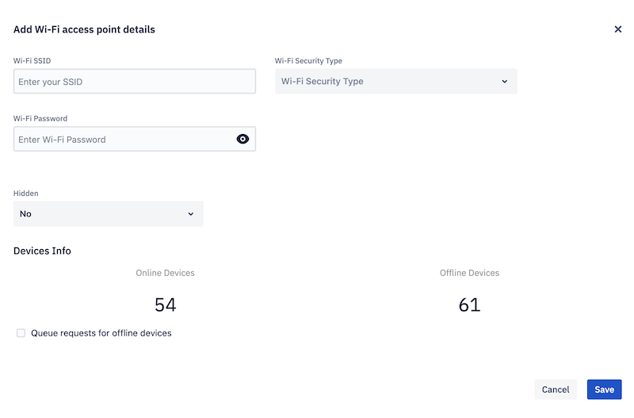
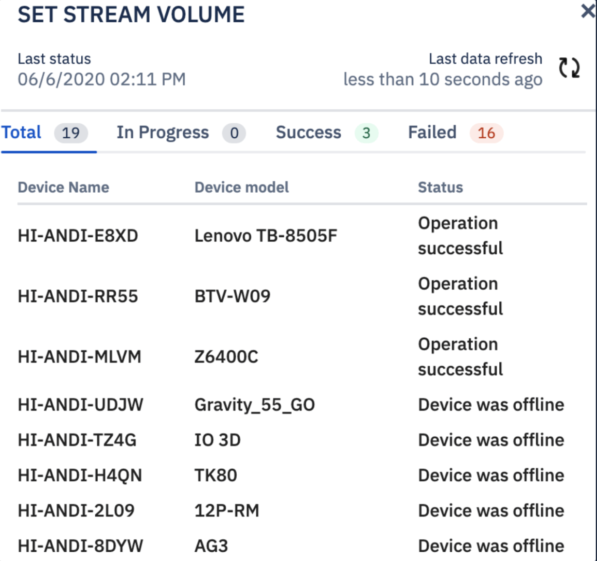
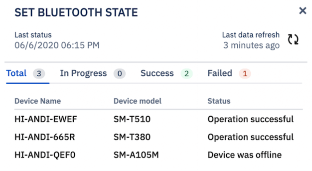
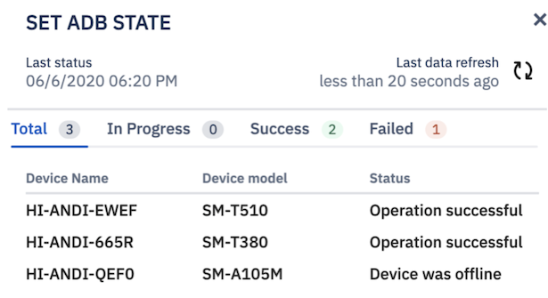

## How to Manage Settings For a Group of Devices?

  

The Settings tab enables you to change the settings on all the devices in a group as a mass action. This includes taking actions like rebooting, locking the screens, and requesting a heartbeat.

  

  

**Note**: Any actions initiated to a group are immediate, they are not queued. Devices that are offline (inactive) will be unable to receive the command for these actions. Esper employs a combination of pop downs and slide-outs to give you both status and summary of an action taken with a group of devices.

  

### Reboot a Group of Devices From the Console

  

When you click on **Reboot**, You will see a pop-up to confirm your choice. When you click on the Yes button, the Esper Console will send the command to reboot all the active devices in the group. Clicking on the No button will take you back to the group settings page. A pop up will show the progress of the action, indicating the number of successful and unsuccessful attempts.

  

Click on **See Details** to see the status of each of the devices in the group.

  

  

Once the set of reboot commands are sent, a success toast notification will appear in the bottom left corner of the screen.

###  Screen Lock a Group of Devices From the Console

  

When you click on the **Screen Lock** button, you will see a pop up to confirm your choice. When you click on the Yes button, the Esper Console will send the command to lock the screen to all the active devices in the group. A pop up will show the progress of the action, indicating the number of successful and unsuccessful attempts. When you click on the No button, you will be taken back to the group settings screen.

  

  
  

Click on **See Details** to see the status of each of the devices in the group.

  

  

Once the set of screen lock commands are sent, a success toast will appear in the bottom left-hand corner of the screen.

###  Ping a Group of Devices from the Console

  

When you click the Heart Beat button, a pop-up will be shown to confirm your choice. When you choose Yes, the Esper Console will attempt to ping all the devices in the group. A pop up will show the progress of the action, indicating the number of successful and unsuccessful attempts. If you click on the No button, you will be taken back to the group setting screen.

  

  

Click on **See Details** and a slide-out will appear.

  

Once the set of ping commands are sent, a success toast will appear in the bottom left-hand corner of the screen.

  

###  Remove/Factory Reset a Group of Devices From the Console

  

**Note**: The Wipe Command has been renamed to“Remove/Factory Reset,” providing additional capability.

Users will have an option to ‘Remove Devices’ from the Esper Dashboard. When you click Remove/Factory Reset, the Esper Console will send a command to all the devices in the group to Factory Reset For online devices, factory reset will be enabled always.

  

A pop up will show the progress of the action, indicating the number of successful and unsuccessful attempts.

  

  

Click on See details and a slide-out will appear.

  

  

Once the set of wipe commands are sent, a success toast will appear in the bottom left-hand corner of the screen.

### Push New Access Point to a Group of Devices From the Console

  

When you push a Wi-Fi access point to a group, you’ll be asked to enter the details of the Wi-Fi access point.

  
  

When you click Save all the active devices will receive the command to connect to the new Wi-Fi access point. As with the other action commands in this section, a pop-up will show the progress of the action, indicating the number of successful and unsuccessful attempts on active devices as well as the number of inactive devices. Clicking on the **Cancel** button will take you back to the group setting page.

  

###  Broadcasting a Message to All the Device in a Group

Broadcast message allows you to send a message to all the devices in the selected group. You can access this feature from the ‘Device and Group’ screen. Click on the eye icon (more information).

Step 1: Click on the **Broadcast Message** button.

  

  

Step 2: Enter the subject and the body of the message. You can also include a link. You will be asked to enter the end date and time for the message. The date and time can be set for the device time zone or the console time zone. This is useful when the device is at a different location. The message will not be sent after the specified date and time.

  

**Note**: The message is sent only to the online devices. It will try to send the message to offline devices till the selected date and time.

  

When you select the ‘Schedule Delivery’ checkbox, the message will be sent for the specified date and time. Here, you will be prompted to enter the start date and the time. You can choose the date and time to correspond with the console time zone or the device time zone.

  
  

### Changing the Display Settings for a Group of Devices from the Console

  

This section lets you adjust the display settings of the device.

  

  

Use the Brightness slider to Increase or decrease the brightness of the screen.

Use the Screen Orientation buttons to select your preferred screen orientation, whether auto, landscape, or portrait.

Select a time from the Screen Timeout dropdown menu.

Once all changes are made, click Apply Changes to push them out to the group, or Cancel if you wish to keep the current settings.

A pop-up will show the progress of the action or actions, indicating the number of successful and unsuccessful attempts. In this example, we changed settings for brightness, screen orientation, and screen timeout for the group.

Click on the See Details links for any of the pop down and a slide-out will appear specific to that setting.

  

  

A toast message or messages will appear in the bottom right section of the screen indicating success for executing the command or commands to the group of devices.

  

### Changing the Wallpaper for a Group of Devices from the Console

  

Use this section to change or add wallpaper to your device. You can set the wallpaper for Portrait, Landscape, and Lock Screen.

  

  

###  Changing the Sound Settings For a Group of Devices From the Console

This section lets you adjust the sound settings of the devices in the group. Use the sliders to adjust the:

-   Alarm volume
    
-   Notification volume
    
-   Music volume
    
-   Ring volume
    

  

Once all changes are made, click Apply Changes to push them out to the device, or Cancel if you wish to keep the current settings.

  

  

A pop-down will show the progress of the action or actions, indicating the number of successful and unsuccessful attempts. In this example, we changed settings for alarm volume, notification volume, music volume, and ring volume for the group.

Click on **See Details** for any of the pop down and a slide-out will appear specific to that setting.

  
  

After applying any changes, individual toast messages will appear in the bottom right corner of the screen indicating success or error for each change made.

  
  

###  Control WiFi Access Points for a Group of Devices From the Console

  

Wi-Fi & the Internet enables you to turn Wi-Fi connectivity on or off for all devices in the group.

  

  
  

This can be done if the device has an alternative connection available such as a cellular network via SIM card or Ethernet. You will need to Confirm turning it off before this action is pushed to the group.

  

  

A pop-down will show the progress of the action or actions, indicating the number of successful and unsuccessful attempts.

  

  

Click on See details and a slide-out will appear.

  

  

Once the set of Wi-Fi commands are sent, a success toast message will appear at the bottom left corner of the screen.

  

Note: If you switch off Wi-Fi when no other connection is available, Esper will turn Wi-Fi back on after 10 seconds if no other internet connection is available so Esper can maintain communication with the cloud backend.

###  Turning GPS On/OFF for a Group of Devices from the Console

  

The location enables you to adjust the location settings for all the devices in the group. Choose a location mode from the drop-down, and once selected the command will immediately be sent to the devices in the group.

  

  

A pop-down will show the progress of the action, indicating the number of successful and unsuccessful attempts.

  

  

Click on See Details and a slide-out will appear.

  
  

Once the set of location commands are sent, a success toast message will appear at the bottom left corner of the screen.

  

###  Controlling Bluetooth On/Off for a Group of Devices from the Console

  

Bluetooth & Devices enables you to turn Bluetooth connectivity on or off for all the devices in the group. Immediately upon switching either on or off, the command will be fired to the devices.

  

  

A pop-down will show the progress of the action, indicating the number of successful and unsuccessful attempts.

  

  

Click on See details and a slide out will appear.

  

  

Once the set of Bluetooth commands are sent, a success toast message will appear at the bottom left corner of the screen.

  

###  Allow ADB for a Group of Devices From the Console

  

ADB Access enables you to turn Android Debug Bridge on or off for all the devices in the group.

  

  

Clicking **ON** will then open a drop-down menu to select the desired session duration. Once selected, click **Apply changes** to push the command to the devices, or **Cancel** if you wish to keep the current settings. A pop-down will show the progress of the action, indicating the number of successful and unsuccessful attempts.

  

  

Click on See details and a slide-out will appear.

  

  

Once the set of commands are sent, a success toast message will appear at the bottom left corner of the screen.