## How to Manage the Settings For a Group of Devices?

  

The Settings tab enables you to change the settings on all the devices in a group. This includes taking actions like rebooting, locking the screens, and requesting a heartbeat.

  

  

:::tip
Any actions initiated to a group are immediate, they cannot queued. Devices that are offline (inactive) will not receive the command for these actions. Esper employs a combination of pop downs and slide-outs to give you both status and summary of an action taken with a group of devices.
:::

  

### Reboot a Group of Devices From the Console

  

When you click on **Reboot**, you will see a pop-up to confirm your choice. When you click on the **Yes** button, the Esper Console will send the command to reboot all the active devices in the group. Clicking on the **No** button will take you back to the group settings page. A pop up will show the progress of the action, indicating the number of successful and unsuccessful attempts.

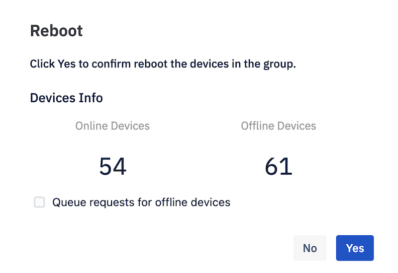

  

Click **See Details** to see the status of each of the devices in the group.

  

  

Once the set of reboot commands are sent, a success toast notification will appear in the bottom left corner of the screen.

###  Screen Lock a Group of Devices From the Console

  

When you click on the **Screen Lock** button, you will see a pop up to confirm your choice. When you click on the **No** button, you will be taken back to the group settings screen. When you click on the **Yes** button, the Esper Console will send the command to lock the screen of all the active devices in the group. A pop up will show the progress of the action, indicating the number of successful and unsuccessful attempts. 

  

  
  

Click **See Details** to see the status of each of the devices in the group.

  

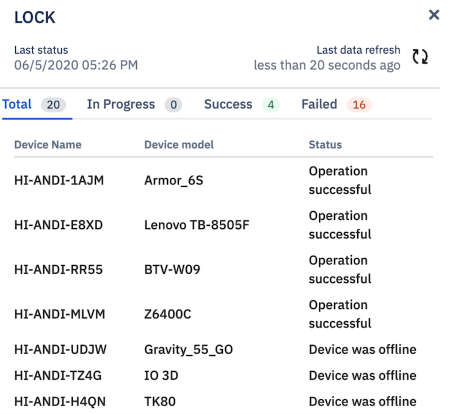

  

Once the set of screen lock commands are sent, a success toast will appear in the bottom left-hand corner of the screen.

###  Ping a Group of Devices from the Console

  

When you click the Heart Beat button, a pop-up will be shown to confirm your choice. When you choose **Yes**, the Esper Console will attempt to ping all the devices in the group. A pop up will show the progress of the action, indicating the number of successful and unsuccessful attempts. If you click the **No** button, you will be taken back to the group setting screen.

  

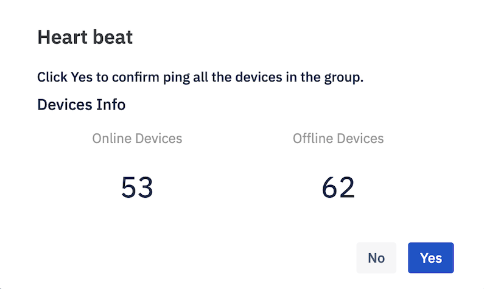

  

Click **See Details** and a slide-out will appear.

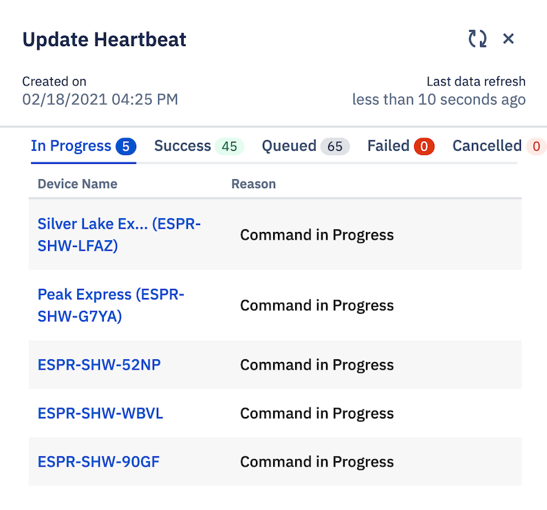

  

Once the set of ping commands are sent, a success toast will appear in the bottom left-hand corner of the screen.

  

###  Remove/Factory Reset a Group of Devices From the Console

You can remove the devices from the Esper Dashboard. When you click Remove/Factory Reset, the Esper Console will send a command to all the online devices in the group to Factory Reset. The factory reset option will always be enabled.

  

A pop up will show the progress of the action, indicating the number of successful and unsuccessful attempts.

  

  

Click **See details** and a slide-out will appear displaying the details of the action.

  

  

### Push New Access Point to a Group of Devices From the Console

  

When you push a Wi-Fi access point to a group, you’ll be asked to enter the details of the Wi-Fi access point.

  
  

When you click **Save** all the active devices will receive the command to connect to the new Wi-Fi access point. A pop-up will show the progress of the action, indicating the number of successful and unsuccessful attempts. Clicking on the **Cancel** button will take you back to the group setting page.

  

###  Broadcasting a Message to All the Device in a Group

Broadcast message allows you to send a message to all the devices in the selected group. You can access this feature from the ‘Device & Group’ screen > Click on the eye icon (more information).

Step 1: Click on the **Broadcast Message** button.

  

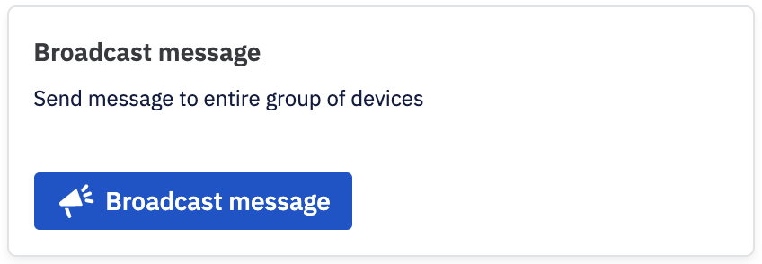

  

Step 2: Enter the subject and the body of the message. You can include an optional link. Enter the end date and time for the message. 

For devices at a different location, you can reference the date and time from the device or the Console. The Console will not send the message after the specified date and time.

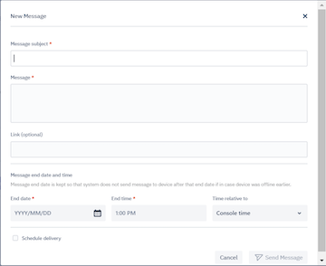

  

:::tip
The message is sent to the online devices only. The Console will try to send the message to offline devices till the selected end date and time.
:::
  

When you select the ‘Schedule Delivery’ checkbox, the message will be sent on the specified date and time. Here, you need to enter the start date and the time. You can choose the date and time to correspond with the Console time zone or the device time zone.

  
  

### Changing the Display Settings for a Group of Devices from the Console

  

In this section you can adjust the display settings of the device.

  

  

Use the Brightness slider to increase or decrease the brightness of the screen.

Use the Screen Orientation buttons to select your preferred screen orientation- auto, landscape, or portrait.

Select a time from the screen timeout dropdown menu.

Click **Apply Changes** to push the chnages to the group, or **Cancel** if you wish to keep the current settings.

A pop-up will show the progress of the actions, indicating the number of successful and unsuccessful attempts. 

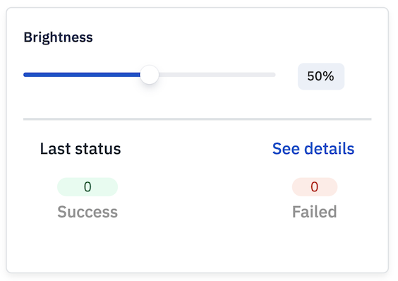

Click the **See Details** links and a slide-out will appear specific to that setting.

  

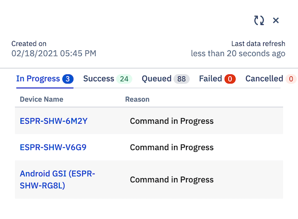

  

A toast message will appear in the bottom left section of the screen indicating success/failure for executing the command to the group of devices.

  

### Changing the Wallpaper for a Group of Devices from the Console

  

Use this section to change or add wallpaper to your device. You can set the wallpaper for Portrait, Landscape, and Lock Screen.

  

  

###  Changing the Sound Settings For a Group of Devices From the Console

This section lets you adjust the sound settings of the devices in the group. Use the sliders to adjust the:

-   Alarm volume
-   Notification volume
-   Music volume
-   Ring volume
    

  

Click **Apply Changes** to push the chnages to the device, or **Cancel** if you wish to keep the current settings.

  

  

A pop-down will show the progress indicating the number of successful and unsuccessful attempts. 

Click **See Details** and slide-out with details will be displayed.

  
  

After applying changes, toast messages will appear in the bottom left corner of the screen indicating success/ failure. 

  
  

###  Control WiFi Access Points for a Group of Devices From the Console

  

Wi-Fi enables you to turn Wi-Fi connectivity On or Off for all devices in the group.

  

  
  

This can be done if the device has an alternative connection available such as a cellular network via SIM card or Ethernet. You will need to confirm turning it Off before this action is pushed to the group.

  

  

A pop-down will show the progress of the action or actions, indicating the number of successful and unsuccessful attempts.

  

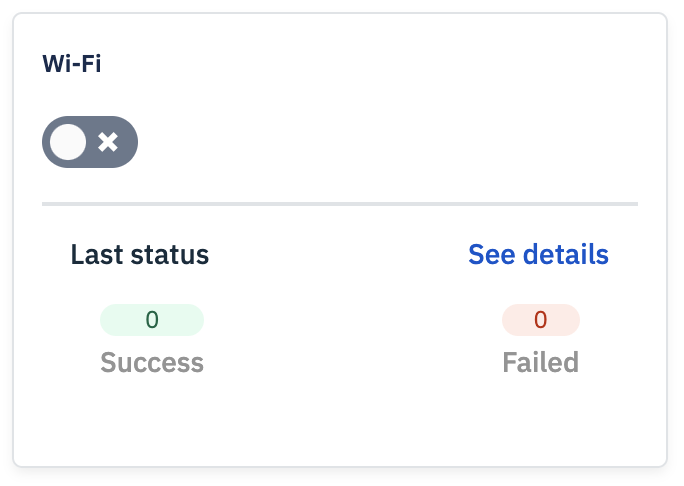

  

Click **See details** and a slide-out will appear.

  

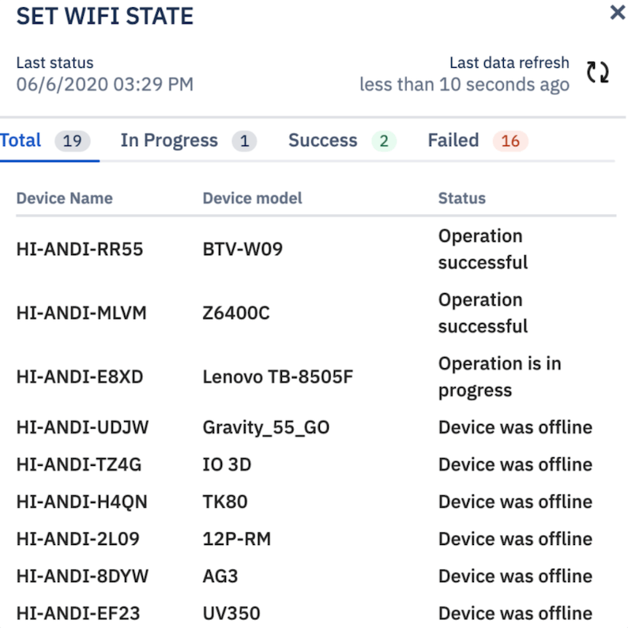

  

Once the set of Wi-Fi commands are sent, a success toast message will appear at the bottom left corner of the screen.

  

:::tip
Esper will turn Wi-Fi On after 10 seconds if no other internet connection is available so Esper can maintain communication with the devices.
:::

###  Turning GPS ON/OFF for a Group of Devices from the Console

  

The enables you to adjust the location settings for all the devices in the group. Choose a location mode from the drop-down, and a command will immediately be sent to the devices in the group.

  

  

A pop-down will show the progress of the action, indicating the number of successful and unsuccessful attempts.

  

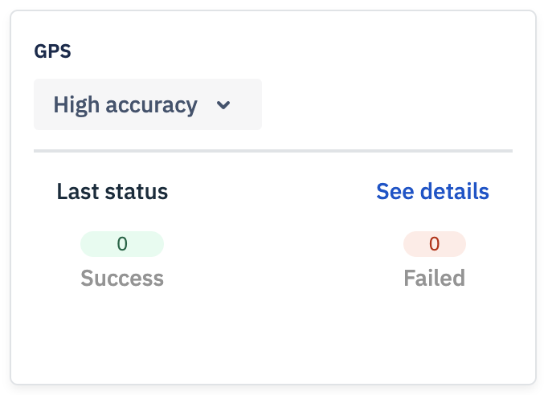

  

Click **See Details** and a slide-out will appear.

  
  

Once the set of location commands are sent, a success toast message will appear at the bottom left corner of the screen.

  

###  Controlling Bluetooth for a Group of Devices from the Console

  

Bluetooth enables you to turn Bluetooth connectivity On or Off for all the devices in the group. Once the option is selected, the command will be fired to all the devices.

  

  

A pop-down will show the progress of the action, indicating the number of successful and unsuccessful attempts.

  

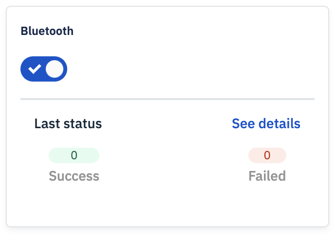

  

Click **See details** and a slide out will appear.

  

  

Once the set of Bluetooth commands are sent, a success toast message will appear at the bottom left corner of the screen.

  

###  Allow ADB for a Group of Devices From the Console

  

ADB Access enables you to turn Android Debug Bridge on or Off for all the devices in the group.

  

  

Clicking **ON** will then open a drop-down menu to select the desired session duration. Click **Apply Changes** to push the command to the devices, or **Cancel** if you wish to keep the current settings. 

A pop-down will show the progress of the action, indicating the number of successful and unsuccessful attempts.

  

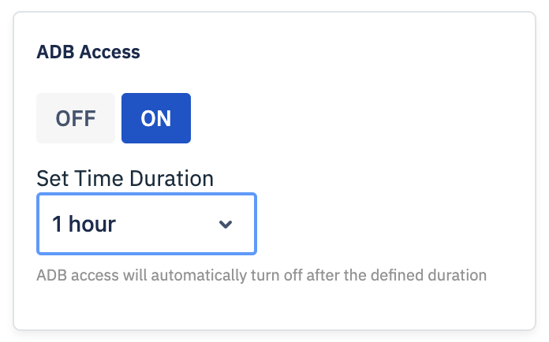

  

Click **See details** and a slide-out will appear.

  

  

Once the set of commands are sent, a success toast message will appear at the bottom left corner of the screen.