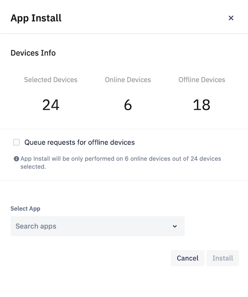
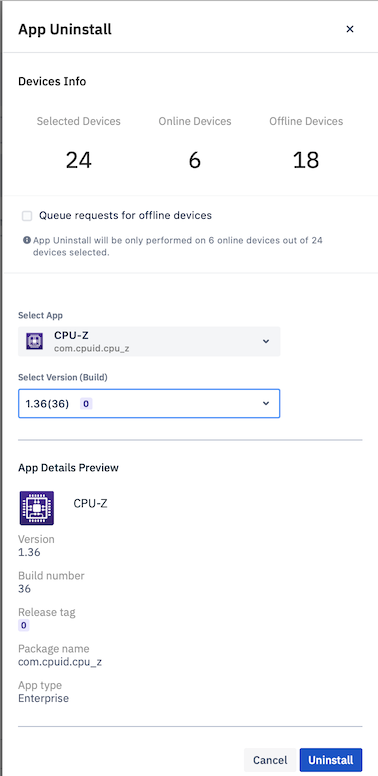
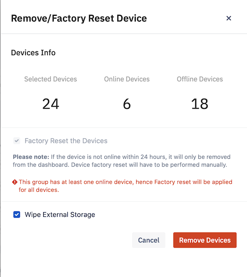

## How to Take Quick Actions on the Selected Devices in the Devices and Groups Section?

  

The Action drop-down is available when you select a device using the ‘Select Device’ link on the right side of the ‘Device and Group’ screen. The Actions drop-down gives you a set of specific actions you can take on any devices you’ve selected when in Device Pane List view and Grid View. It is an unavailable Map view. We support a few quick actions like Move Devices, Ping, Reboot, App Install, App Uninstall, Apply Policy and Remove/Factory Reset Device.

  

  

### Move devices:

  

You will use the ‘Move Devices’ option to move devices between groups. Make sure you are in the List view or the Grid View to select the devices you wish to move. Go to **Actions** > **Move Devices**, and you can select the destination group to move the devices. Select the button on the right side of the group, then click Move Devices.

  

Visit  [How to move devices to another device group](./device-move.md)  for the step by step instructions on how to move devices.

  

### Ping:

  

Esper Managed devices are continuously communicating with our Cloud and updating their statuses every minute. If a device dozes off due to inactivity or a bad network connection, Esper Cloud will regularly wake them and ask for a status update. Clicking on the Ping option lets you accomplish the same task manually.

  

  

### Reboot:

  

When you click on the Reboot option, the Esper Console will send the command to reboot the active device.

  
  

  

### App Install:

  

The App install quick action lets you install both privately uploaded apps—also known as Enterprise Apps—and Google Play apps to the selected devices.

  

Visit how to install an app for the step by step instructions on how to install an app.

  

### App Uninstall:

  

The App Uninstall quick action lets you Uninstall both privately uploaded apps—also known as Enterprise Apps—and Google Play apps to the selected devices.

  

  

Visit  how to Uninstall an app for step by step instructions.

### Apply Policy:

  

When you apply a Compliance Policy to a group, all the online devices will receive a command to comply with the policy. If you select the checkbox next to, “Queue requests for offline devices”, the system will queue policy updates to be pushed to all offline devices that come back online within the next 24 hours.

  

  

### Remove / Factory reset device:

  

**Note**: The Wipe Device Command has been renamed to “Remove/Factory Reset,” providing additional capability.

Users will have an option to remove devices from the Esper Dashboard. This is applicable to one or more devices or groups. There is a checkbox for ‘Factory Reset the Devices’ and for ‘Wipe External Storage.’

**Note**: By default, this option will be checked. For online devices, factory reset will be enabled.

  

