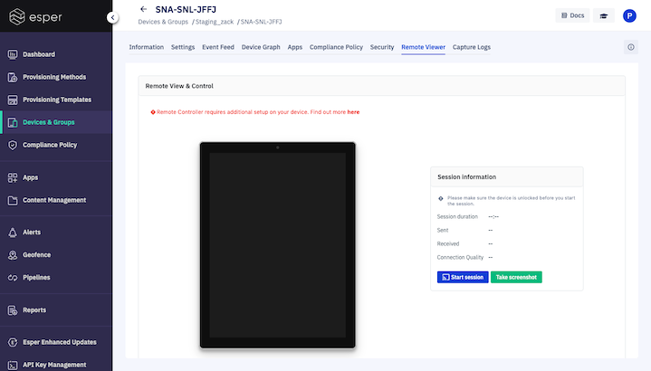
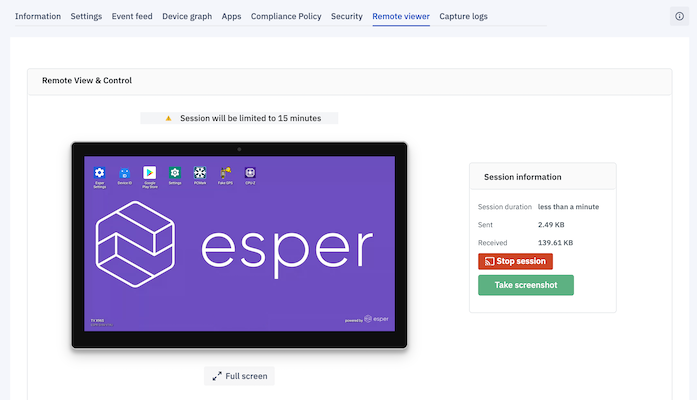
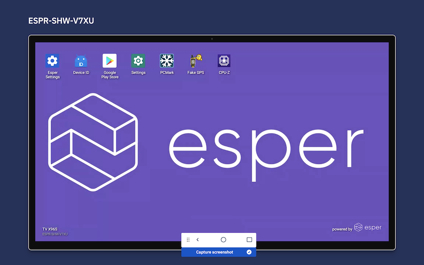

## What is Remote Viewer and Control on a Single Device?

The 'Remote Viewer' section enables you to remotely view a device and take screenshots.

### Setup a Remote Viewer on a Single Device

  

To set up Remote Viewer following the steps:

  

Step 1: To remotely view a device, click on **Start Session**.

  

  

**Note**: You can start a remote view session only on online devices.

On devices using Android 9.0 and above, the Esper Console will establish a secure connection with the device, and the device’s screen will be streamed to the Console. On devices Android 7.0 or earlier, the remote control will be enabled by default. Now, supervisor permission is not required to allow remote control. Once the remote view request is allowed, a secure connection will be established, and the device’s screen will be streamed to the Console.

***Warning**: If your device is running with an app in Kiosk mode and permission is required to initiate a remote view session, the notification will not display over the pinned Kiosk mode app. To get around this some customers exit Kiosk mode after provisioning and Always accept the notification part of their preparation process. Alternatively, if the device is already in the field it can be done at the deployment site by a local device user.*

**Note**: The session will end automatically after 15 minutes.

  

To end the session earlier, click Stop Session.

### Capturing a Screenshot on a Single Device

Step 1: Click the **Take Screenshot** button to capture the current device screen.

**Note**: There is a recorded history of all screenshots captured per device at the bottom of the Remote Viewer section.

The Portrait button allows you to rotate the screen to portrait as well as landscape mode. Only a single device-to-cloud session is allowed at a time. The Full-Screen button allows you to remotely view the device in full-screen mode.

While in Full-Screen mode using Remote Control, a widget at the lower right corner of the screen will enable navigation on a remote device that has hard keys. If the control widget happens to overlap with the frame, grab and move it to clear space on the Console screen. To enter Full-screen mode click the button below the device screen.

  

To exit the full-screen view, simply press esc on your PC’s keyboard.

### Setup a Remote Control on a Single Device

On Esper Enhanced Android Devices or devices that have a manufacturer signed Esper agent in the system, there is an option to Remote Control the device. This means you may interact with the remote device using your mouse as though you were physically touching the screen. Since Esper has obtained membership in SEAP (Samsung Enterprise Alliance Program), our platform now supports Samsung Knox-specific extensions. We now provide the Remote Control feature available for any Esper provisioned Samsung devices running Knox 3.x or newer. If the remote control option is not supported for your device, we display a message in the Remote view.

You can use the remote control in both view modes: Full-screen and non-full-screen.

**Note**: The widget is only available in full-screen mode.

### Hardware Keys and Keyboard Events

Some devices do not have soft keys for home, back, and recent and they use physical keys on the device instead. On such devices, a virtual set of keys appear at the bottom right corner of the Remote Control screen. When in Full-screen mode, the widget includes the hard keys. You can grab and move the widget to a different location on your screen as you wish.

Additionally, we have enabled keyboard events so users can use the keyboard on their system to type, and are not forced to use the keyboard on the device by clicking on each character using the mouse pointer.